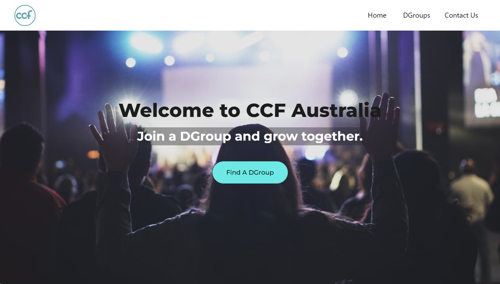

# CCF DGroup Connect App

A single-page application that displays a list of DGroups in CCF Australia.

## Deployed App

Access the deployed App at https://ccf-dgroups.netlify.app/

## Github Repository

View the source code and project details on GitHub repository: https://github.com/jmcaluyafuentes/ccf-dgroup-mngt

## Features

1. Displays a list of DGroups, showing the DGroup name, life stage, and satellite name for each group.

2. The DGroups are sorted alphabetically by DGroup name for easy navigation.

3. Users can filter the list based on satellite and/or life stage, allowing them to view only the DGroups that may be of interest for joining.

4. Users can click on a DGroup to view its detailed information, providing a deeper insight into the group.

#### App screenshot of Home Page:



#### App screenshot of DGroup Page:


#### App screenshot in mobile screen:


## Installation and Set Up Instructions

Follow these steps to get the project running on your local machine:

### 1. Prerequisites

Make sure you have the following installed:

- Node.js  
- npm (Node Package Manager)

### 2. Clone the Repository

First, clone the repository to your local machine:

```
git clone https://github.com/jmcaluyafuentes/ccf-dgroup-mngt.git
```

Navigate to the project directory:

```
cd ccf-dgroup-mngt
```

### 3. Install Dependencies

Run the following command to install the required dependencies:

```
npm install
```

### 4. Running the Application

To start the development server, run:

```
npm run dev
```

This will launch the application at http://localhost:5173/ by default.

### 5. Running Tests

```
npm test
```

Note: Unit tests have not yet been implemented. The current focus is on finalizing and optimizing the folder structure for scalability. Once this is complete, unit tests will be added. Please check the repository for updates in the coming days.

## Tech Stack

- React: A JavaScript library for building user interfaces.
- Vite: A build tool that provides a faster and leaner development experience for modern web projects.
- JavaScript: The primary programming language used for application logic.
- CSS: For styling and layout of the application.
- Bulma: A modern CSS framework that provides ready-to-use components and a grid system that allows for quick styling and layout adjustments without needing extensive custom CSS.
- Axios: A promise-based HTTP client for making API requests.
- React Router: For handling routing and navigation within the application.
